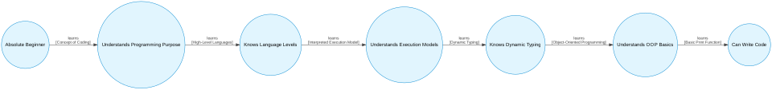

# Code-Mixed Pedagogical Flow Extractor

## Overview
Here, I attempt to build a pipeline which takes a code-mixed (Indic-English) YouTube video, extracts the core concepts, identifies prerequisites and outputs a structured formal flow, in a machine-readable way.  
This project also notes linguistic standardisation, explicitly mapping colloquial Indic terms and code-mixed analogies back to their formal academic English equivalents
All the code can be found in [code.ipynb](code.ipynb).

Video Link: [https://www.youtube.com/watch?v=zZTzmOQytG0](https://www.youtube.com/watch?v=zZTzmOQytG0)

---

## Video Selection
To build and test this pipeline, I utilized educational transcripts featuring heavy code-mixing. 

These are the videos I selected. The pipeline can be run on any one of these, or **any other video on YouTube** by proceeding as prompted by the [code.ipynb](code.ipynb) file.

The videos we selected are as follows:
1. [Python in Kannada - Introduction to Coding and Python | Full Course for Beginners - #1](https://www.youtube.com/watch?v=8c74mXV2lJ0&list=PLlGueSbLhZoBRnTsGiDJeTXuQCALOTN07) | KANNADA+ENGLISH
2. [Chapter1- The Living World ಕನ್ನಡದಲ್ಲಿ | biology | NCERT](https://www.youtube.com/watch?v=lse_2joLgLo) | KANNADA+ENGLISH
3. [Embryo Sac Development|Sexual Reproduction in flowering plants in kannada| BIOLOGY|NEET](https://www.youtube.com/watch?v=EibWp3ssXi4) | KANNADA+ENGLISH
4. [Banking of Road with friction for JEE & NEET | Class 11 Physics in Minutes](https://www.youtube.com/watch?v=_qrM61-9td8) | HINDI+ENGLISH
5. [Extension of the British rule. Class 10th. History. Kannada explanation. Part 1.](https://www.youtube.com/watch?v=h_cCv4W3IBI) | KANNADA+ENGLISH

## Architectural Choices & Chosen Output Structure

We are tasked with:
1. Extracting core concepts
2. Linguistic Standardisation
3. Mapping Prerequisites
4. Representing output data in a machine-readable format

### What is a Core Concept?

To me, a topic lies in a very specific zone. It should not be too broad, nor should it be too narrow.  
To explain what I mean by this, consider the example below:  

*"Welcome to Maths Class. Ivattu nāvu ondu short trick nōḍōṇa. For example, nammalli ondu even number ide, let's say 24 into 5. Idu tumba simple. First ā number annu 2 inda divide māḍi. 24 divide by 2 is 12. Āmēle, adara pakkadalli ondu zero sērisi. So, answer 120. Ide thara bēre even numbers gū māḍabahudu"*

TRANSLATED: *Welcome to Maths Class. Today we will see a short trick. For example, we have an even number, let's say 24 into 5. This is very simple. First divide that number by 2. 24 divide by 2 is 12. Then, add a zero next to it. So, answer 120. You can do the same for other even numbers*

Now, if I give this prompt directly to an AI, it may occasionally be **too broad**, by saying that the key topics are maths and multiplication.  
It might also be **too narrow**, doing something like saying that it is a trick to multiply 24 and 5. 

These are both bad.  
Having thought about it, a "core topic" to me falls into **3 main properties**. These are as follows:  
1. A defined rule / concept
2. An operational mechanism (i.e. an explanation given as to how to do `1.`)
3. Prerequisites - This has been [elaborated on](#prerequisite-knowledge)

Using the example above:
1. Defined rule / concept: Multiplying even numbers by 5  
2. Operational Mechanism: Divide by 2, and then place a 0 at the right-end
3. Prerequisites: You need to know what even numbers are

I will do this through Pydantic.

### Epistemic State Machine

Here, I wanted to model the *learner* on the basis of data, not the data itself. What do I mean by this?

Instead of outputting a simple adjacency list or a standard JSON array that just maps static data points, I will model the dependencies as an **Epistemic State Machine (automaton)**.  

By defining my Pydantic schema to output *States* and *Transitions*, I force the LLM to do more than just extract, it acts as a rules engine generator. By analyzing the sequential logic of the transliterated text, the model maps the exact knowledge state the teacher relies on before executing the next pedagogical transition.

The decision to model the dependencies as an Epistemic State Machine rather than a standard JSON array is grounded in **Knowledge Space Theory (KST)**. 

**Reference:** Dowling et al.'s *Automata for the Assessment of Knowledge*. IEEE Transactions on Knowledge and Data Engineering.

As proven in this research, an individual's learning pathway is best modeled mathematically as a finite state automaton. By forcing the LLM to extract data into strict `prerequisite_state` and `target_state` keys, the output isn't just a static map, it is an executable rules engine. This approach mathematically bounds the LLM to the pedagogical flow of the transcript, preventing it from hallucinating "global knowledge" outside of the machine's defined transition pathways.

### Prerequisite Knowledge

I read that a common failure point in educational NLP is *"global knowledge hallucination"*, where an LLM pulls in outside mathematical dependencies that were never discussed in the audio. [source](https://arxiv.org/pdf/2602.11181). To solve this, the pipeline is strictly bound to the pedagogical flow of the transcript.

- The system does not ask the LLM: *"What are the prerequisites for multiplying by 5?"*
- The system asks: *"Within the logical flow of this specific lesson, what prior state did the teacher establish before executing this new rule?"*

This ensures the generated state machine is a mathematically accurate representation of the teacher's lesson plan, completely immune to external context hallucination.

### Language

- I will be using Gemini Pro to identify core concepts from the transliterated text.  
- I will prompt engineer Gemini Pro to extract the core concepts, and specifically output them only in English.  
- The reason for outputting the concepts only in English is to make it easier to process and possible to validate for languages that I do not know.  

### The Problem with Pure Prompting

Just telling Gemini to "extract the core topics" is not a good idea. LLM's are inherently stochastic, which present 2 failure points for Information Extraction:
1. The format won't be consistent
2. Context hallucinations. LLM's are prone to hallucinations especially in code-mixed settings. [src](https://arxiv.org/pdf/2602.11181)

### Ensuring robustness

Above, I have stated that I will be using Gemini, and then listed reasons for which that is a bad idea. This seems rather contradictory.  
The question remains, **"How do I ensure robustness?"**

I use the LLM for its ability to understand the semantic meaning of the transliterated code-mixed language, but I force its output through a rigid formal grammar. I do this by using a structured output schema, which the LLM must follow. I force the model to categorize its extraction into defined keys representing an Automaton:
1. prerequisite_state (the starting knowledge required)
2. topic_name (the transition concept)
3. explanation (the operational mechanism of the transition)
4. target_state (the new knowledge state achieved)

By forcing the model into this specific JSON schema, I transition the unstructured text into a clean database object, completely immune to prompt drift.

### Linguistic Standardization

A common way to handle code-mixed text is to just tell an LLM to "translate everything to English." I think this is a flawed approach.

First, it translates invisibly, so we have no way to audit how it handled the slang. Second, it frequently destroys teaching analogies. For example, if a teacher compares a variable to an empty "dabba", a basic translation just outputs the word "box", completely losing the actual computer science concept of "memory allocation".

To solve this, I treated this as an Ontology Alignment problem. While that sounds like a heavy term, it simply means taking concepts from one knowledge system (the teacher's informal, cultural slang) and mapping them directly to another (formal academic English).

Instead of trusting the LLM to do a "black-box" translation in the background, my pipeline features Auditable Semantic Glossing. Simply put: I force the model to explicitly build a dictionary.

Using Pydantic, I require the LLM to extract a terminology_glossary alongside the core concepts. The pipeline isolates every colloquial Indic term, domain-specific slang, or analogy, and explicitly maps it to its rigorous English academic equivalent. This ensures that the informal pedagogical intent is preserved, and anyone evaluating the output can see exactly how the code-mixing was handled

---

## Setup Instructions

1. Clone this repository
2. In a virtual environment, run `pip install -r requirements.txt`
3. Run `sudo apt install graphviz ffmpeg` (On Debian Linux)
4. Click Run All in [code.ipynb](code.ipynb) and proceed as prompted.
